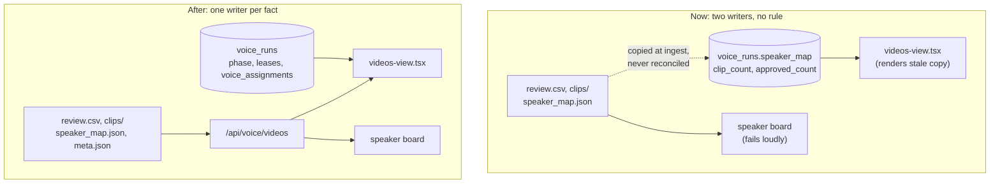

> **Canonical contract.** This SPEC and the files in `companions:` are the complete contract for what to build, test, and validate. See `brownfield.md` for the verified evidence behind every claim in "Why".

# Factory Is The Source Of Truth

## Why

Two services write the same facts, and no rule says which one is right.

The voice factory owns the disk that holds the audio. It computes clip counts,
speaker labels, and keep decisions from `review.csv`. The orchestrator keeps its
own copy of those facts in `voice_runs`, and nothing reconciles the two.

On 2026-08-20 a package refactor in `star-trek-voyicer` moved every path root up
one directory. `WORK_DIR` then pointed at a directory that does not exist.
`GET /videos` answered `{"videos": []}` and returned HTTP 200, because an empty
directory and a missing directory look the same to that route. The factory went
blind for three ingested videos and 183 review rows.

The dashboard showed no error. It kept rendering video cards, because
`videos-view.tsx` builds them from `voice_runs` in Postgres, not from the
factory. The speaker board failed at the same moment, because that path does ask
the factory. One outage, two different behaviours, no signal that they shared a
cause.

The copy is what hid the failure. This spec removes the copy.

## Capabilities

- **CAP-1**
  - **intent:** Every fact has exactly one writer, so the two services cannot disagree.
  - **success:** `voice_runs` holds no column the factory also computes. A reviewer can name the owner of any field from `data-model.md` without reading code.

- **CAP-2**
  - **intent:** A blind or unreachable factory shows as an error, never as an empty or stale list.
  - **success:** With `VOICE_FACTORY_URL` pointing at a stopped service, the videos view shows an error state. It does not render video cards from Postgres.

- **CAP-3**
  - **intent:** A run whose video the factory no longer knows is visible as an orphan, not as a normal card.
  - **success:** Given a `voice_runs` row whose `video_id` is absent from `GET /videos`, the videos view marks that run as orphaned and offers no review action.

- **CAP-4**
  - **intent:** Clip and speaker reads address a video directly, so no run lookup can break them.
  - **success:** `GET /api/voice/videos/{video_id}/clips` serves the review screen. A video with no run at all is still reviewable.

- **CAP-5**
  - **intent:** A video carries its own title, so a second character reusing it sees the same name.
  - **success:** Ingest video V under character A. Claim V under character B. Both show the same title, and neither reads it from a `voice_runs` row.

- **CAP-6**
  - **intent:** The proxy adds one origin and nothing else, so a factory field never needs a second schema here.
  - **success:** Adding a field to the factory's video summary makes it reachable in the browser with no change to `models/voice.py`.

## Constraints

- The factory keeps its filesystem. It gains no database. Training needs the GPU
  host, and the audio must stay next to the code that reads it.
- `voice_runs.video_id` stays, and stays nullable. It is the only join between
  the two systems.
- `voice_assignments` stays in Postgres. It maps a speaker label to a Voice id,
  and the factory has no concept of a Voice. It is not a mirror of `speaker_map`.
- The browser never calls the factory. Clips, audio, and video lists keep
  proxying through `/api/voice/...`, so there is one origin and one CORS entry.
- No route may report a missing directory as an empty collection. A read against
  a `WORK_DIR` that does not exist raises, so the 2026-08-20 failure mode cannot
  repeat silently.
- SQLAlchemy 2.0 async only. No raw SQL.
- Dropping columns needs a real migration or a documented drop-and-recreate.
  `Base.metadata.create_all` does not alter an existing table.

## Non-goals

- The LangGraph phase machine does not change. `voice_runs.phase` stays the state
  machine, and `VoiceRunReconciler` stays its only writer.
- The lease columns, error counters, and retry route do not change.
- GraphQL is not adopted. The problem is ownership, not query shape. A GraphQL
  layer over two writers would return the same disagreement in a nicer envelope.
- Merging the two repositories is out of scope. The GPU boundary is the reason
  they are split, and it still holds.
- `current_epoch` and `current_loss` are left alone here. They mirror the
  factory's training log, but they are a display snapshot that must survive a
  finished job. See `data-model.md` for the open question.

## Success signal

Stop the voice factory. The videos view shows an error, not cards. Start it
again. The three ingested videos appear with real titles, and the speaker board
loads for each. Delete a `voice_runs` row's video from the factory's `work/`
directory. That run shows as orphaned, and every other run still works.

## Assumptions

- Assumed the factory should own the video title. It does not store one today,
  so this spec adds `meta.json` per video directory rather than backfilling
  `voice_runs.video_title`. `data-model.md` records the alternative and why it
  was not chosen. This is the one decision here that adds a factory-side write.
- Assumed one extra HTTP call per run list is acceptable. Resolving titles and
  orphan status now costs a `GET /videos` alongside the run query. Both are
  local, and the call is what makes an orphan visible.
